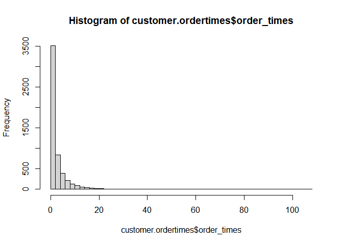
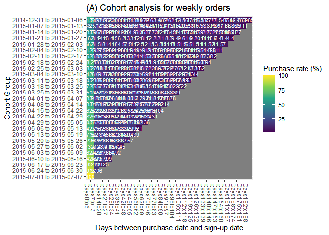
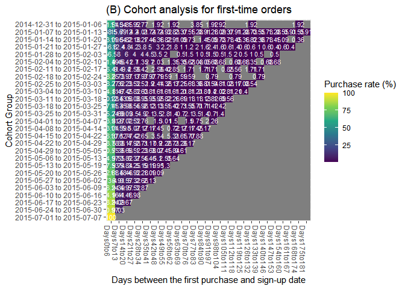
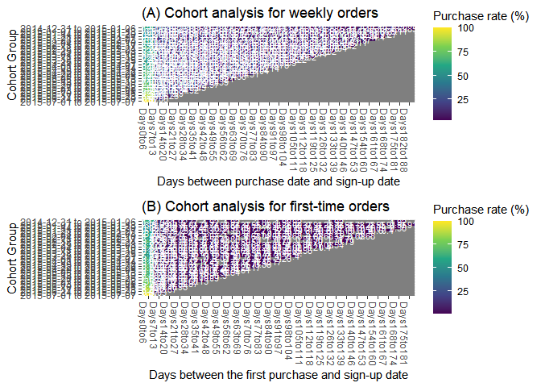
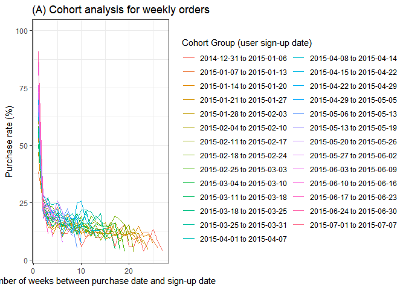
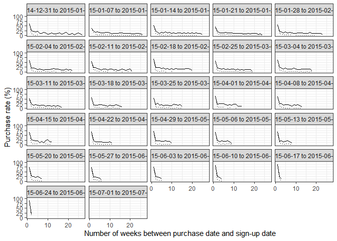

Corhort_analysis_in_R
================
Amanda Wu
2023-05-25

# Load libraries

``` r
# install.packages("dplyr") # to install this package for joining data frames
library(dplyr)
```

    ## 
    ## Attaching package: 'dplyr'

    ## The following objects are masked from 'package:stats':
    ## 
    ##     filter, lag

    ## The following objects are masked from 'package:base':
    ## 
    ##     intersect, setdiff, setequal, union

``` r
# install.packages('ascii') # to install this package for joining matrix
library(ascii)

# install.packages("tidyr") # to install this package for data wrangling
library(tidyr)
```

    ## 
    ## Attaching package: 'tidyr'

    ## The following object is masked from 'package:ascii':
    ## 
    ##     expand

``` r
# install.packages("tidyverse"), lubricate package is within tidyverse; lubricate is used for converting time zones
library(lubridate)
```

    ## 
    ## Attaching package: 'lubridate'

    ## The following objects are masked from 'package:base':
    ## 
    ##     date, intersect, setdiff, union

``` r
# The easiest way to get ggplot2 is to install the whole tidyverse: install.packages("tidyverse")
library(ggplot2)

# install.packages("gridExtra"); this package helps combine multiple ggplot together 
library(gridExtra)
```

    ## 
    ## Attaching package: 'gridExtra'

    ## The following object is masked from 'package:dplyr':
    ## 
    ##     combine

# Read data files and examine the data structure

``` r
# define the directory 
pathname<-"C:/Users/Amanda/Desktop/jobs/job_prep_materials/Applying/Invitae/Cohort_Analysis/Cohort_Analysis/" # this is the directory where I stored the csv files (please modify according to your directory)

# read csv files 
customer.df<-read.csv(paste0(pathname, "customers.csv")) # customer 
order.df<-read.csv(paste0(pathname, "orders.csv")) # order 

# Look at the basics of customer.df
head(customer.df)
```

    ##      id             created
    ## 1 35410 2015-07-03 22:01:11
    ## 2 35417 2015-07-03 22:11:23
    ## 3 35412 2015-07-03 22:02:52
    ## 4 35413 2015-07-03 22:05:02
    ## 5 35424 2015-07-03 22:21:55
    ## 6 35559 2015-07-04 17:18:13

``` r
dim(customer.df) # 25716 rows of data 
```

    ## [1] 25716     2

``` r
# change column names 
colnames(customer.df)<-c("user_id", "sign_up_date")

# Look at the basics of order.df
head(order.df)
```

    ##     id order_number user_id             created
    ## 1 1709           36     344 2014-10-28 00:20:01
    ## 2 1406            7     608 2014-10-14 23:44:53
    ## 3 1716            6    2296 2014-10-28 17:47:07
    ## 4 1426            2    1225 2014-10-15 18:33:38
    ## 5 1415            6     797 2014-10-15 02:07:16
    ## 6 1708            1     183 2014-10-27 23:12:55

``` r
dim(order.df) # 27575 rows of data 
```

    ## [1] 27575     4

``` r
# change column names 
colnames(order.df)<-c("order_id", "order_number", "user_id", "order_date")
```

# Join the two data frames and do some data wrangling

``` r
# join the two data frame based on column user_id
join.df<-full_join(order.df,customer.df,  by = "user_id")
head(join.df) # notice that some rows have missing data, because the customer.df is a smaller subset within order.df
```

    ##   order_id order_number user_id          order_date sign_up_date
    ## 1     1709           36     344 2014-10-28 00:20:01         <NA>
    ## 2     1406            7     608 2014-10-14 23:44:53         <NA>
    ## 3     1716            6    2296 2014-10-28 17:47:07         <NA>
    ## 4     1426            2    1225 2014-10-15 18:33:38         <NA>
    ## 5     1415            6     797 2014-10-15 02:07:16         <NA>
    ## 6     1708            1     183 2014-10-27 23:12:55         <NA>

``` r
# delete rows where either sign_up_date and order_date is empty
delete.index<-unique(c(which(is.na(join.df$sign_up_date)),  which(is.na(join.df$order_date))))
join.complete.df<-join.df[-delete.index,]

# check the data frame
join.complete.df[1:20,]
```

    ##      order_id order_number user_id          order_date        sign_up_date
    ## 1165     8256            2   12654 2015-02-17 20:03:27 2015-01-20 02:45:51
    ## 1183     3981            1    9568 2015-01-03 02:44:32 2015-01-03 02:22:02
    ## 1787     4078            2    9652 2015-01-05 19:46:03 2015-01-05 02:20:38
    ## 2017     4022            1    9513 2015-01-04 04:11:18 2015-01-01 23:18:44
    ## 2023     4039            2    9580 2015-01-04 21:31:48 2015-01-03 06:19:15
    ## 2037     4062            1    9661 2015-01-05 17:13:02 2015-01-05 17:06:39
    ## 2048     4027            1    9628 2015-01-04 17:35:12 2015-01-04 15:54:27
    ## 2055     4020            1    9580 2015-01-04 03:22:05 2015-01-03 06:19:15
    ## 2058     4084            1    9572 2015-01-05 21:05:09 2015-01-03 02:44:18
    ## 2062     4120            1    9569 2015-01-06 00:32:59 2015-01-03 02:24:45
    ## 2068     3992            1    9593 2015-01-03 18:22:05 2015-01-03 18:09:25
    ## 2071     4046            1    9647 2015-01-05 01:10:54 2015-01-05 00:48:32
    ## 2073     4123            1    9676 2015-01-06 00:43:12 2015-01-06 00:25:04
    ## 2086     4028            1    9630 2015-01-04 17:43:31 2015-01-04 17:39:04
    ## 2087     4118            3    9580 2015-01-06 00:19:06 2015-01-03 06:19:15
    ## 2089     4033            1    9607 2015-01-04 19:29:33 2015-01-03 23:19:02
    ## 2105     3909            1    9488 2015-01-01 04:29:18 2015-01-01 02:24:36
    ## 2107     4050            1    9652 2015-01-05 02:32:48 2015-01-05 02:20:38
    ## 2108     4054            1    9653 2015-01-05 03:33:18 2015-01-05 03:11:00
    ## 2130     3916            1    9507 2015-01-01 21:30:14 2015-01-01 20:23:12

``` r
tail(join.complete.df)
```

    ##       order_id order_number user_id          order_date        sign_up_date
    ## 26240     5234            1   12570 2015-01-19 03:31:29 2015-01-19 02:22:46
    ## 26242     8244            3    9890 2015-02-17 18:02:46 2015-01-10 00:09:57
    ## 26243     8268            2   11507 2015-02-17 21:22:31 2015-01-12 19:17:08
    ## 26244     8281            1   12171 2015-02-17 22:32:19 2015-01-15 23:03:43
    ## 26245     8262            4   12428 2015-02-17 20:52:42 2015-01-17 21:46:48
    ## 27251     8249            2   15030 2015-02-17 18:35:39 2015-02-09 23:27:05

``` r
nrow(join.complete.df) # 17015 rows left
```

    ## [1] 17015

``` r
# check if all order date is later than sign up date
which(join.complete.df$order_date < join.complete.df$sign_up_date ) # yes, indeed all order date is later than sign up date
```

    ## integer(0)

``` r
# check if some customers have multiple times of order
customer.ordertimes<-join.complete.df %>% group_by(user_id) %>% summarise(order_times = n())
hist(customer.ordertimes$order_times, breaks = 50) # yes, indeed some customers ordered more than 1 time 
```

<!-- -->

``` r
# Convert UTC time to PDT 
for(columname in  c("order_date", "sign_up_date")){
join.complete.df[,columname]<-as.POSIXct(join.complete.df[,columname], tz="UTC") # define the current format as UTC
print(join.complete.df[,columname][1:6]) # print original time in UTC
join.complete.df[, columname]<-with_tz(join.complete.df[,columname], "America/Los_Angeles") # convert from UTC to PDT(Pacific Daylight Time) time zone  
print(join.complete.df[,columname][1:6]) # print to visually confirm that the conversion is correct
}
```

    ## [1] "2015-02-17 20:03:27 UTC" "2015-01-03 02:44:32 UTC"
    ## [3] "2015-01-05 19:46:03 UTC" "2015-01-04 04:11:18 UTC"
    ## [5] "2015-01-04 21:31:48 UTC" "2015-01-05 17:13:02 UTC"
    ## [1] "2015-02-17 12:03:27 PST" "2015-01-02 18:44:32 PST"
    ## [3] "2015-01-05 11:46:03 PST" "2015-01-03 20:11:18 PST"
    ## [5] "2015-01-04 13:31:48 PST" "2015-01-05 09:13:02 PST"
    ## [1] "2015-01-20 02:45:51 UTC" "2015-01-03 02:22:02 UTC"
    ## [3] "2015-01-05 02:20:38 UTC" "2015-01-01 23:18:44 UTC"
    ## [5] "2015-01-03 06:19:15 UTC" "2015-01-05 17:06:39 UTC"
    ## [1] "2015-01-19 18:45:51 PST" "2015-01-02 18:22:02 PST"
    ## [3] "2015-01-04 18:20:38 PST" "2015-01-01 15:18:44 PST"
    ## [5] "2015-01-02 22:19:15 PST" "2015-01-05 09:06:39 PST"

``` r
# calculate the days between sign up date and order date
join.complete.df$days_after_signup<-as.numeric(floor((join.complete.df$order_date-join.complete.df$sign_up_date)/1440 ))
head(join.complete.df)
```

    ##      order_id order_number user_id          order_date        sign_up_date
    ## 1165     8256            2   12654 2015-02-17 12:03:27 2015-01-19 18:45:51
    ## 1183     3981            1    9568 2015-01-02 18:44:32 2015-01-02 18:22:02
    ## 1787     4078            2    9652 2015-01-05 11:46:03 2015-01-04 18:20:38
    ## 2017     4022            1    9513 2015-01-03 20:11:18 2015-01-01 15:18:44
    ## 2023     4039            2    9580 2015-01-04 13:31:48 2015-01-02 22:19:15
    ## 2037     4062            1    9661 2015-01-05 09:13:02 2015-01-05 09:06:39
    ##      days_after_signup
    ## 1165                28
    ## 1183                 0
    ## 1787                 0
    ## 2017                 2
    ## 2023                 1
    ## 2037                 0

``` r
# calculate the week number between sign up date and order date
join.complete.df$weeks_after_signup<-as.numeric(floor(join.complete.df$days_after_signup/7)+1)
```

# Do cohort analysis for total users (including repetitive buyers)

``` r
# first group the customer by the week they signed up
join.complete.df$CohortGroup<-cut(join.complete.df$sign_up_date, breaks="7 days", labels=FALSE)
# how many bins should there be?
as.numeric((max(join.complete.df$sign_up_date)-min(join.complete.df$sign_up_date))/7) # there should be 27 bins
```

    ## [1] 26.83939

``` r
# check if the time bins are correct 
range(join.complete.df$sign_up_bin)
```

    ## [1]  Inf -Inf

``` r
join.complete.df[1:20,]
```

    ##      order_id order_number user_id          order_date        sign_up_date
    ## 1165     8256            2   12654 2015-02-17 12:03:27 2015-01-19 18:45:51
    ## 1183     3981            1    9568 2015-01-02 18:44:32 2015-01-02 18:22:02
    ## 1787     4078            2    9652 2015-01-05 11:46:03 2015-01-04 18:20:38
    ## 2017     4022            1    9513 2015-01-03 20:11:18 2015-01-01 15:18:44
    ## 2023     4039            2    9580 2015-01-04 13:31:48 2015-01-02 22:19:15
    ## 2037     4062            1    9661 2015-01-05 09:13:02 2015-01-05 09:06:39
    ## 2048     4027            1    9628 2015-01-04 09:35:12 2015-01-04 07:54:27
    ## 2055     4020            1    9580 2015-01-03 19:22:05 2015-01-02 22:19:15
    ## 2058     4084            1    9572 2015-01-05 13:05:09 2015-01-02 18:44:18
    ## 2062     4120            1    9569 2015-01-05 16:32:59 2015-01-02 18:24:45
    ## 2068     3992            1    9593 2015-01-03 10:22:05 2015-01-03 10:09:25
    ## 2071     4046            1    9647 2015-01-04 17:10:54 2015-01-04 16:48:32
    ## 2073     4123            1    9676 2015-01-05 16:43:12 2015-01-05 16:25:04
    ## 2086     4028            1    9630 2015-01-04 09:43:31 2015-01-04 09:39:04
    ## 2087     4118            3    9580 2015-01-05 16:19:06 2015-01-02 22:19:15
    ## 2089     4033            1    9607 2015-01-04 11:29:33 2015-01-03 15:19:02
    ## 2105     3909            1    9488 2014-12-31 20:29:18 2014-12-31 18:24:36
    ## 2107     4050            1    9652 2015-01-04 18:32:48 2015-01-04 18:20:38
    ## 2108     4054            1    9653 2015-01-04 19:33:18 2015-01-04 19:11:00
    ## 2130     3916            1    9507 2015-01-01 13:30:14 2015-01-01 12:23:12
    ##      days_after_signup weeks_after_signup CohortGroup
    ## 1165                28                  5           3
    ## 1183                 0                  1           1
    ## 1787                 0                  1           1
    ## 2017                 2                  1           1
    ## 2023                 1                  1           1
    ## 2037                 0                  1           1
    ## 2048                 0                  1           1
    ## 2055                 0                  1           1
    ## 2058                 2                  1           1
    ## 2062                 2                  1           1
    ## 2068                 0                  1           1
    ## 2071                 0                  1           1
    ## 2073                 0                  1           1
    ## 2086                 0                  1           1
    ## 2087                 2                  1           1
    ## 2089                 0                  1           1
    ## 2105                 0                  1           1
    ## 2107                 0                  1           1
    ## 2108                 0                  1           1
    ## 2130                 0                  1           1

``` r
tail(join.complete.df)
```

    ##       order_id order_number user_id          order_date        sign_up_date
    ## 26240     5234            1   12570 2015-01-18 19:31:29 2015-01-18 18:22:46
    ## 26242     8244            3    9890 2015-02-17 10:02:46 2015-01-09 16:09:57
    ## 26243     8268            2   11507 2015-02-17 13:22:31 2015-01-12 11:17:08
    ## 26244     8281            1   12171 2015-02-17 14:32:19 2015-01-15 15:03:43
    ## 26245     8262            4   12428 2015-02-17 12:52:42 2015-01-17 13:46:48
    ## 27251     8249            2   15030 2015-02-17 10:35:39 2015-02-09 15:27:05
    ##       days_after_signup weeks_after_signup CohortGroup
    ## 26240                 0                  1           3
    ## 26242                38                  6           2
    ## 26243                36                  6           2
    ## 26244                32                  5           3
    ## 26245                30                  5           3
    ## 27251                 7                  2           6

``` r
# create reference data frame of total users for each cohort group
base_cohort_df = join.complete.df %>% group_by(CohortGroup) %>% summarise(TotalUsers = n_distinct(user_id), cohortname= paste(substr(min(sign_up_date),1,10),"to",substr(max(sign_up_date),1,10)))
head(base_cohort_df)
```

    ## # A tibble: 6 × 3
    ##   CohortGroup TotalUsers cohortname              
    ##         <int>      <int> <chr>                   
    ## 1           1         52 2014-12-31 to 2015-01-06
    ## 2           2        548 2015-01-07 to 2015-01-13
    ## 3           3        275 2015-01-14 to 2015-01-20
    ## 4           4        500 2015-01-21 to 2015-01-27
    ## 5           5        200 2015-01-28 to 2015-02-03
    ## 6           6        148 2015-02-04 to 2015-02-10

``` r
# create purchase activity data frame
activity_cohort_df = join.complete.df %>% group_by(CohortGroup, weeks_after_signup) %>% summarise( BuyingUsers = n_distinct(user_id))
```

    ## `summarise()` has grouped output by 'CohortGroup'. You can override using the
    ## `.groups` argument.

``` r
head(activity_cohort_df)
```

    ## # A tibble: 6 × 3
    ## # Groups:   CohortGroup [1]
    ##   CohortGroup weeks_after_signup BuyingUsers
    ##         <int>              <dbl>       <int>
    ## 1           1                  1          32
    ## 2           1                  2          14
    ## 3           1                  3          12
    ## 4           1                  4          10
    ## 5           1                  5          12
    ## 6           1                  6           6

``` r
# join activity_cohort_df and base_cohort_df
user_cohort_df = inner_join(activity_cohort_df, base_cohort_df, 
                  by = 'CohortGroup')

# Cohort table by the counts of users
cohort_retention_df = user_cohort_df %>% select(CohortGroup,  cohortname, TotalUsers, weeks_after_signup, BuyingUsers) %>%spread(weeks_after_signup, BuyingUsers)
head(cohort_retention_df)
```

    ## # A tibble: 6 × 30
    ## # Groups:   CohortGroup [6]
    ##   CohortGroup cohortname    TotalUsers   `1`   `2`   `3`   `4`   `5`   `6`   `7`
    ##         <int> <chr>              <int> <int> <int> <int> <int> <int> <int> <int>
    ## 1           1 2014-12-31 t…         52    32    14    12    10    12     6     6
    ## 2           2 2015-01-07 t…        548   211   138    98   101    87    81    82
    ## 3           3 2015-01-14 t…        275   146    65    47    30    43    41    55
    ## 4           4 2015-01-21 t…        500   234   106    72    67    75    81    65
    ## 5           5 2015-01-28 t…        200   113    43    36    28    36    29    35
    ## 6           6 2015-02-04 t…        148    91    30    29    25    21    22    21
    ## # ℹ 20 more variables: `8` <int>, `9` <int>, `10` <int>, `11` <int>,
    ## #   `12` <int>, `13` <int>, `14` <int>, `15` <int>, `16` <int>, `17` <int>,
    ## #   `18` <int>, `19` <int>, `20` <int>, `21` <int>, `22` <int>, `23` <int>,
    ## #   `24` <int>, `25` <int>, `26` <int>, `27` <int>

``` r
# change the column names 
for (colno in colnames(cohort_retention_df)[-1:-3]){
  colnames(cohort_retention_df)[as.numeric(colno)+3]<-paste0("Days",as.numeric(colno)*7-7,"to",as.numeric(colno)*7-1)
}
head(cohort_retention_df)
```

    ## # A tibble: 6 × 30
    ## # Groups:   CohortGroup [6]
    ##   CohortGroup cohortname     TotalUsers Days0to6 Days7to13 Days14to20 Days21to27
    ##         <int> <chr>               <int>    <int>     <int>      <int>      <int>
    ## 1           1 2014-12-31 to…         52       32        14         12         10
    ## 2           2 2015-01-07 to…        548      211       138         98        101
    ## 3           3 2015-01-14 to…        275      146        65         47         30
    ## 4           4 2015-01-21 to…        500      234       106         72         67
    ## 5           5 2015-01-28 to…        200      113        43         36         28
    ## 6           6 2015-02-04 to…        148       91        30         29         25
    ## # ℹ 23 more variables: Days28to34 <int>, Days35to41 <int>, Days42to48 <int>,
    ## #   Days49to55 <int>, Days56to62 <int>, Days63to69 <int>, Days70to76 <int>,
    ## #   Days77to83 <int>, Days84to90 <int>, Days91to97 <int>, Days98to104 <int>,
    ## #   Days105to111 <int>, Days112to118 <int>, Days119to125 <int>,
    ## #   Days126to132 <int>, Days133to139 <int>, Days140to146 <int>,
    ## #   Days147to153 <int>, Days154to160 <int>, Days161to167 <int>,
    ## #   Days168to174 <int>, Days175to181 <int>, Days182to188 <int>

``` r
# the percentage version of the dataframe 
cohort_retention.perc<-sapply(cohort_retention_df[,-1:-3], function(x) paste0(round(x/cohort_retention_df$TotalUsers*100,2),"% orderers"))
cohort_retention.perc<-gsub( "NA% orderers", "",cohort_retention.perc)

# bind the count user matrix and percentage user matrix together
cohort_retention_df.perc<-paste.matrix(cohort_retention.perc, "(", cohort_retention_df[,-1:-3],")")
colnames(cohort_retention_df.perc)<-colnames(cohort_retention.perc)
cohort_retention_df.perc<-cbind(cohort_retention_df[,1:3],cohort_retention_df.perc)
head(cohort_retention_df.perc)
```

    ## # A tibble: 6 × 30
    ## # Groups:   CohortGroup [6]
    ##   CohortGroup cohortname     TotalUsers Days0to6 Days7to13 Days14to20 Days21to27
    ##         <int> <chr>               <int> <chr>    <chr>     <chr>      <chr>     
    ## 1           1 2014-12-31 to…         52 61.54% … 26.92% o… 23.08% or… 19.23% or…
    ## 2           2 2015-01-07 to…        548 38.5% o… 25.18% o… 17.88% or… 18.43% or…
    ## 3           3 2015-01-14 to…        275 53.09% … 23.64% o… 17.09% or… 10.91% or…
    ## 4           4 2015-01-21 to…        500 46.8% o… 21.2% or… 14.4% ord… 13.4% ord…
    ## 5           5 2015-01-28 to…        200 56.5% o… 21.5% or… 18% order… 14% order…
    ## 6           6 2015-02-04 to…        148 61.49% … 20.27% o… 19.59% or… 16.89% or…
    ## # ℹ 23 more variables: Days28to34 <chr>, Days35to41 <chr>, Days42to48 <chr>,
    ## #   Days49to55 <chr>, Days56to62 <chr>, Days63to69 <chr>, Days70to76 <chr>,
    ## #   Days77to83 <chr>, Days84to90 <chr>, Days91to97 <chr>, Days98to104 <chr>,
    ## #   Days105to111 <chr>, Days112to118 <chr>, Days119to125 <chr>,
    ## #   Days126to132 <chr>, Days133to139 <chr>, Days140to146 <chr>,
    ## #   Days147to153 <chr>, Days154to160 <chr>, Days161to167 <chr>,
    ## #   Days168to174 <chr>, Days175to181 <chr>, Days182to188 <chr>

# Do cohort analysis for first time orderers

``` r
# retain only the most early record for each user_id from join.complete.df
join.complete.1st_time.df<-join.complete.df%>% group_by(user_id) %>%  filter(order_date == min(order_date)) # the filter function here make sure that each user_id only appeared once, and we select the row according to the earliesr order date of the uer_id

# create purchase activity data frame
activity_1storder_cohort_df = join.complete.1st_time.df %>% group_by(CohortGroup, weeks_after_signup) %>% summarise( FirstTimeUsers = n_distinct(user_id))
```

    ## `summarise()` has grouped output by 'CohortGroup'. You can override using the
    ## `.groups` argument.

``` r
head(activity_1storder_cohort_df)
```

    ## # A tibble: 6 × 3
    ## # Groups:   CohortGroup [1]
    ##   CohortGroup weeks_after_signup FirstTimeUsers
    ##         <int>              <dbl>          <int>
    ## 1           1                  1             32
    ## 2           1                  2              6
    ## 3           1                  3              2
    ## 4           1                  4              1
    ## 5           1                  5              3
    ## 6           1                  7              1

``` r
# join activity_1storder_cohort_df and base_cohort_df
FistTimeUsers_cohort_df = inner_join(activity_1storder_cohort_df, base_cohort_df, 
                  by = 'CohortGroup')

# Cohort table by the counts of users
FistTimeUsers_retention_df = FistTimeUsers_cohort_df %>% select(CohortGroup,  cohortname, TotalUsers, weeks_after_signup, FirstTimeUsers) %>%spread(weeks_after_signup, FirstTimeUsers)
head(FistTimeUsers_retention_df)
```

    ## # A tibble: 6 × 29
    ## # Groups:   CohortGroup [6]
    ##   CohortGroup cohortname    TotalUsers   `1`   `2`   `3`   `4`   `5`   `6`   `7`
    ##         <int> <chr>              <int> <int> <int> <int> <int> <int> <int> <int>
    ## 1           1 2014-12-31 t…         52    32     6     2     1     3    NA     1
    ## 2           2 2015-01-07 t…        548   211    86    39    23    22    15    15
    ## 3           3 2015-01-14 t…        275   146    32    16     6     9     4    12
    ## 4           4 2015-01-21 t…        500   234    62    24    21    19    25    15
    ## 5           5 2015-01-28 t…        200   113    16    12     8     8     9     7
    ## 6           6 2015-02-04 t…        148    91    14     8     4     2     4     3
    ## # ℹ 19 more variables: `8` <int>, `9` <int>, `10` <int>, `11` <int>,
    ## #   `12` <int>, `13` <int>, `14` <int>, `15` <int>, `16` <int>, `17` <int>,
    ## #   `18` <int>, `19` <int>, `20` <int>, `21` <int>, `22` <int>, `23` <int>,
    ## #   `24` <int>, `25` <int>, `26` <int>

``` r
# change the column names 
for (colno in colnames(FistTimeUsers_retention_df)[-1:-3]){
  colnames(FistTimeUsers_retention_df)[as.numeric(colno)+3]<-paste0("Days",as.numeric(colno)*7-7,"to",as.numeric(colno)*7-1)
}

head(FistTimeUsers_retention_df)
```

    ## # A tibble: 6 × 29
    ## # Groups:   CohortGroup [6]
    ##   CohortGroup cohortname     TotalUsers Days0to6 Days7to13 Days14to20 Days21to27
    ##         <int> <chr>               <int>    <int>     <int>      <int>      <int>
    ## 1           1 2014-12-31 to…         52       32         6          2          1
    ## 2           2 2015-01-07 to…        548      211        86         39         23
    ## 3           3 2015-01-14 to…        275      146        32         16          6
    ## 4           4 2015-01-21 to…        500      234        62         24         21
    ## 5           5 2015-01-28 to…        200      113        16         12          8
    ## 6           6 2015-02-04 to…        148       91        14          8          4
    ## # ℹ 22 more variables: Days28to34 <int>, Days35to41 <int>, Days42to48 <int>,
    ## #   Days49to55 <int>, Days56to62 <int>, Days63to69 <int>, Days70to76 <int>,
    ## #   Days77to83 <int>, Days84to90 <int>, Days91to97 <int>, Days98to104 <int>,
    ## #   Days105to111 <int>, Days112to118 <int>, Days119to125 <int>,
    ## #   Days126to132 <int>, Days133to139 <int>, Days140to146 <int>,
    ## #   Days147to153 <int>, Days154to160 <int>, Days161to167 <int>,
    ## #   Days168to174 <int>, Days175to181 <int>

``` r
# the percentage version of the 1st time user dataframe 
FistTimeUsers_retention.perc<-sapply(FistTimeUsers_retention_df[,-1:-3], function(x) paste0(round(x/FistTimeUsers_retention_df$TotalUsers*100,2),"% 1st time"))
FistTimeUsers_retention.perc<-gsub( "NA% 1st time", "",FistTimeUsers_retention.perc)

# bind the first time user count matrix and percentage  matrix together
FistTimeUsers_retention_df.perc<-paste.matrix(FistTimeUsers_retention.perc, "(", FistTimeUsers_retention_df[,-1:-3],")")
colnames(FistTimeUsers_retention_df.perc)<-colnames(FistTimeUsers_retention.perc)
FistTimeUsers_retention_df.perc<-cbind(FistTimeUsers_retention_df[,1:3],FistTimeUsers_retention_df.perc)
head(FistTimeUsers_retention_df.perc)
```

    ## # A tibble: 6 × 29
    ## # Groups:   CohortGroup [6]
    ##   CohortGroup cohortname     TotalUsers Days0to6 Days7to13 Days14to20 Days21to27
    ##         <int> <chr>               <int> <chr>    <chr>     <chr>      <chr>     
    ## 1           1 2014-12-31 to…         52 61.54% … 11.54% 1… 3.85% 1st… 1.92% 1st…
    ## 2           2 2015-01-07 to…        548 38.5% 1… 15.69% 1… 7.12% 1st… 4.2% 1st …
    ## 3           3 2015-01-14 to…        275 53.09% … 11.64% 1… 5.82% 1st… 2.18% 1st…
    ## 4           4 2015-01-21 to…        500 46.8% 1… 12.4% 1s… 4.8% 1st … 4.2% 1st …
    ## 5           5 2015-01-28 to…        200 56.5% 1… 8% 1st t… 6% 1st ti… 4% 1st ti…
    ## 6           6 2015-02-04 to…        148 61.49% … 9.46% 1s… 5.41% 1st… 2.7% 1st …
    ## # ℹ 22 more variables: Days28to34 <chr>, Days35to41 <chr>, Days42to48 <chr>,
    ## #   Days49to55 <chr>, Days56to62 <chr>, Days63to69 <chr>, Days70to76 <chr>,
    ## #   Days77to83 <chr>, Days84to90 <chr>, Days91to97 <chr>, Days98to104 <chr>,
    ## #   Days105to111 <chr>, Days112to118 <chr>, Days119to125 <chr>,
    ## #   Days126to132 <chr>, Days133to139 <chr>, Days140to146 <chr>,
    ## #   Days147to153 <chr>, Days154to160 <chr>, Days161to167 <chr>,
    ## #   Days168to174 <chr>, Days175to181 <chr>

# Bind the total user cohort table and first time user cohort table

``` r
# mask the first three columns of FistTimeUsers_retention_df.perc
FistTimeUsers_retention_df.perc.NA<-FistTimeUsers_retention_df.perc
FistTimeUsers_retention_df.perc.NA[,1:3]<-NA

# Make a for loop to alternatively input the rows from the total user cohort table (cohort_retention_df.perc) and the first time user cohort table (FistTimeUsers_retention_df.perc)
combined.matrix<-data.frame() # empty data frame for storing the data

for (i in 1:nrow(cohort_retention_df.perc)){
  rbined.matrix<-rbind(cohort_retention_df.perc[i,], FistTimeUsers_retention_df.perc.NA[i,])
  combined.matrix<-rbind(data.frame(combined.matrix),data.frame(rbined.matrix))
}

head(combined.matrix)
```

    ##   CohortGroup               cohortname TotalUsers                Days0to6
    ## 1           1 2014-12-31 to 2015-01-06         52  61.54% orderers ( 32 )
    ## 2          NA                     <NA>         NA  61.54% 1st time ( 32 )
    ## 3           2 2015-01-07 to 2015-01-13        548  38.5% orderers ( 211 )
    ## 4          NA                     <NA>         NA  38.5% 1st time ( 211 )
    ## 5           3 2015-01-14 to 2015-01-20        275 53.09% orderers ( 146 )
    ## 6          NA                     <NA>         NA 53.09% 1st time ( 146 )
    ##                 Days7to13             Days14to20              Days21to27
    ## 1  26.92% orderers ( 14 ) 23.08% orderers ( 12 )  19.23% orderers ( 10 )
    ## 2   11.54% 1st time ( 6 )   3.85% 1st time ( 2 )    1.92% 1st time ( 1 )
    ## 3 25.18% orderers ( 138 ) 17.88% orderers ( 98 ) 18.43% orderers ( 101 )
    ## 4  15.69% 1st time ( 86 )  7.12% 1st time ( 39 )    4.2% 1st time ( 23 )
    ## 5  23.64% orderers ( 65 ) 17.09% orderers ( 47 )  10.91% orderers ( 30 )
    ## 6  11.64% 1st time ( 32 )  5.82% 1st time ( 16 )    2.18% 1st time ( 6 )
    ##               Days28to34             Days35to41             Days42to48
    ## 1 23.08% orderers ( 12 )  11.54% orderers ( 6 )  11.54% orderers ( 6 )
    ## 2   5.77% 1st time ( 3 )                 ( NA )   1.92% 1st time ( 1 )
    ## 3 15.88% orderers ( 87 ) 14.78% orderers ( 81 ) 14.96% orderers ( 82 )
    ## 4  4.01% 1st time ( 22 )  2.74% 1st time ( 15 )  2.74% 1st time ( 15 )
    ## 5 15.64% orderers ( 43 ) 14.91% orderers ( 41 )    20% orderers ( 55 )
    ## 6   3.27% 1st time ( 9 )   1.45% 1st time ( 4 )  4.36% 1st time ( 12 )
    ##               Days49to55             Days56to62             Days63to69
    ## 1  15.38% orderers ( 8 )  13.46% orderers ( 7 )   5.77% orderers ( 3 )
    ## 2                 ( NA )   1.92% 1st time ( 1 )                 ( NA )
    ## 3 16.61% orderers ( 91 ) 16.06% orderers ( 88 ) 14.42% orderers ( 79 )
    ## 4  2.92% 1st time ( 16 )  3.83% 1st time ( 21 )  2.37% 1st time ( 13 )
    ## 5 14.91% orderers ( 41 ) 16.36% orderers ( 45 ) 11.27% orderers ( 31 )
    ## 6   1.82% 1st time ( 5 )   2.91% 1st time ( 8 )   1.09% 1st time ( 3 )
    ##               Days70to76            Days77to83             Days84to90
    ## 1   9.62% orderers ( 5 ) 13.46% orderers ( 7 )   9.62% orderers ( 5 )
    ## 2                 ( NA )  3.85% 1st time ( 2 )                 ( NA )
    ## 3  9.67% orderers ( 53 ) 11.5% orderers ( 63 ) 12.41% orderers ( 68 )
    ## 4   0.55% 1st time ( 3 )  1.28% 1st time ( 7 )   0.91% 1st time ( 5 )
    ## 5 12.73% orderers ( 35 )   12% orderers ( 33 ) 12.73% orderers ( 35 )
    ## 6   0.73% 1st time ( 2 )                ( NA )   1.45% 1st time ( 4 )
    ##               Days91to97            Days98to104           Days105to111
    ## 1   9.62% orderers ( 5 )  11.54% orderers ( 6 )  13.46% orderers ( 7 )
    ## 2   1.92% 1st time ( 1 )   1.92% 1st time ( 1 )                 ( NA )
    ## 3 11.31% orderers ( 62 ) 13.32% orderers ( 73 ) 14.05% orderers ( 77 )
    ## 4   1.28% 1st time ( 7 )   1.09% 1st time ( 6 )  2.37% 1st time ( 13 )
    ## 5 13.45% orderers ( 37 )    12% orderers ( 33 ) 14.55% orderers ( 40 )
    ## 6   1.09% 1st time ( 3 )   0.73% 1st time ( 2 )   0.73% 1st time ( 2 )
    ##             Days112to118           Days119to125           Days126to132
    ## 1   5.77% orderers ( 3 )  13.46% orderers ( 7 )  15.38% orderers ( 8 )
    ## 2                 ( NA )                 ( NA )   1.92% 1st time ( 1 )
    ## 3 10.58% orderers ( 58 )  11.5% orderers ( 63 ) 10.58% orderers ( 58 )
    ## 4   0.91% 1st time ( 5 )   1.28% 1st time ( 7 )   0.73% 1st time ( 4 )
    ## 5 10.55% orderers ( 29 ) 13.45% orderers ( 37 ) 10.91% orderers ( 30 )
    ## 6   1.45% 1st time ( 4 )   0.36% 1st time ( 1 )   1.82% 1st time ( 5 )
    ##             Days133to139           Days140to146           Days147to153
    ## 1   5.77% orderers ( 3 )   5.77% orderers ( 3 )  11.54% orderers ( 6 )
    ## 2                 ( NA )                 ( NA )                 ( NA )
    ## 3 11.31% orderers ( 62 )  8.76% orderers ( 48 )  9.67% orderers ( 53 )
    ## 4   0.55% 1st time ( 3 )   0.73% 1st time ( 4 )   1.28% 1st time ( 7 )
    ## 5 12.73% orderers ( 35 ) 11.27% orderers ( 31 ) 14.55% orderers ( 40 )
    ## 6   0.36% 1st time ( 1 )   0.73% 1st time ( 2 )   1.45% 1st time ( 4 )
    ##             Days154to160           Days161to167          Days168to174
    ## 1   3.85% orderers ( 2 )   7.69% orderers ( 4 ) 13.46% orderers ( 7 )
    ## 2                 ( NA )                 ( NA )  1.92% 1st time ( 1 )
    ## 3 11.68% orderers ( 64 ) 11.86% orderers ( 65 ) 8.39% orderers ( 46 )
    ## 4   0.55% 1st time ( 3 )   0.91% 1st time ( 5 )  0.55% 1st time ( 3 )
    ## 5 10.18% orderers ( 28 ) 10.91% orderers ( 30 ) 7.27% orderers ( 20 )
    ## 6   1.09% 1st time ( 3 )                 ( NA )  0.36% 1st time ( 1 )
    ##            Days175to181         Days182to188
    ## 1  7.69% orderers ( 4 ) 3.85% orderers ( 2 )
    ## 2                ( NA )                 <NA>
    ## 3 5.11% orderers ( 28 )               ( NA )
    ## 4  0.91% 1st time ( 5 )                 <NA>
    ## 5                ( NA )               ( NA )
    ## 6                ( NA )                 <NA>

``` r
# save the data frame as csv
write.csv(combined.matrix, paste0(pathname, "cohort_analysis_output.csv"), row.names = FALSE)
```

# Data visualization

# Total user cohort heatmap

``` r
# Below, I'm trying to make a heat map of the retention rate for total buyers 
# delete the characters and convert the data frame to numeric
cohort_retention.perc2<-sapply(data.frame(gsub("% orderers", "", cohort_retention.perc)),  function(x) as.numeric(x))
cohort_retention_df.perc2<-cbind(cohort_retention_df.perc[,1:3],cohort_retention.perc2)
head(cohort_retention_df.perc2)
```

    ## # A tibble: 6 × 30
    ## # Groups:   CohortGroup [6]
    ##   CohortGroup cohortname     TotalUsers Days0to6 Days7to13 Days14to20 Days21to27
    ##         <int> <chr>               <int>    <dbl>     <dbl>      <dbl>      <dbl>
    ## 1           1 2014-12-31 to…         52     61.5      26.9       23.1       19.2
    ## 2           2 2015-01-07 to…        548     38.5      25.2       17.9       18.4
    ## 3           3 2015-01-14 to…        275     53.1      23.6       17.1       10.9
    ## 4           4 2015-01-21 to…        500     46.8      21.2       14.4       13.4
    ## 5           5 2015-01-28 to…        200     56.5      21.5       18         14  
    ## 6           6 2015-02-04 to…        148     61.5      20.3       19.6       16.9
    ## # ℹ 23 more variables: Days28to34 <dbl>, Days35to41 <dbl>, Days42to48 <dbl>,
    ## #   Days49to55 <dbl>, Days56to62 <dbl>, Days63to69 <dbl>, Days70to76 <dbl>,
    ## #   Days77to83 <dbl>, Days84to90 <dbl>, Days91to97 <dbl>, Days98to104 <dbl>,
    ## #   Days105to111 <dbl>, Days112to118 <dbl>, Days119to125 <dbl>,
    ## #   Days126to132 <dbl>, Days133to139 <dbl>, Days140to146 <dbl>,
    ## #   Days147to153 <dbl>, Days154to160 <dbl>, Days161to167 <dbl>,
    ## #   Days168to174 <dbl>, Days175to181 <dbl>, Days182to188 <dbl>

``` r
# melt the dataframes for plotting
cohort_retention_df.perc.melt = gather(cohort_retention_df.perc2, "Order.date.since.signup", "BuyingUsersPerc", 4:ncol(cohort_retention_df.perc2))
cohort_retention_df.perc.melt<-cohort_retention_df.perc.melt[-which(is.na(cohort_retention_df.perc.melt)),]
cohort_retention_df.perc.melt[1:10,] # remove NAs
```

    ## # A tibble: 10 × 5
    ## # Groups:   CohortGroup [10]
    ##    CohortGroup cohortname      TotalUsers Order.date.since.sig…¹ BuyingUsersPerc
    ##          <int> <chr>                <int> <chr>                            <dbl>
    ##  1           1 2014-12-31 to …         52 Days0to6                          61.5
    ##  2           2 2015-01-07 to …        548 Days0to6                          38.5
    ##  3           3 2015-01-14 to …        275 Days0to6                          53.1
    ##  4           4 2015-01-21 to …        500 Days0to6                          46.8
    ##  5           5 2015-01-28 to …        200 Days0to6                          56.5
    ##  6           6 2015-02-04 to …        148 Days0to6                          61.5
    ##  7           7 2015-02-11 to …        117 Days0to6                          56.4
    ##  8           8 2015-02-18 to …        126 Days0to6                          68.2
    ##  9           9 2015-02-25 to …        369 Days0to6                          58.3
    ## 10          10 2015-03-04 to …        248 Days0to6                          64.1
    ## # ℹ abbreviated name: ¹​Order.date.since.signup

``` r
# reorder the Order.date.since.signup
cohort_retention_df.perc.melt$Order.date.since.signup<-factor(cohort_retention_df.perc.melt$Order.date.since.signup, levels = unique(cohort_retention_df.perc.melt$Order.date.since.signup))

# ggplot
cohort_retention.perc.ggplot<-ggplot(cohort_retention_df.perc.melt) +
  geom_raster(aes(x = Order.date.since.signup,
                  y = reorder(cohortname , desc(cohortname)),
                  fill = BuyingUsersPerc), show.legend=TRUE) +
    scale_fill_viridis_c(name = "Purchase rate (%)") + 
  geom_text(aes(x = Order.date.since.signup,
                y = reorder(cohortname, desc(cohortname)),
                label = BuyingUsersPerc), col = "white",size = 3) +
#  scale_y_discrete(labels = unique(cohort_retention_df.perc.melt$cohortname))+
  labs(
    title = "(A) Cohort analysis for weekly orders",
    x = "Days between purchase date and sign-up date",
    y = "Cohort Group"
  )+
  theme(axis.text.x=element_text(angle = -90, hjust = 0))

cohort_retention.perc.ggplot
```

<!-- -->

## First Time user cohort heatmap

``` r
# Below, I'm trying to make a heat map of the retention rate for first time buyers 
# delete the characters and convert the data frame to numeric
FistTimeUsers_retention.perc2<-sapply(data.frame(gsub("% 1st time", "", FistTimeUsers_retention.perc)),  function(x) as.numeric(x))
FistTimeUsers_retention_df.perc2<-cbind(FistTimeUsers_retention_df.perc[,1:3],FistTimeUsers_retention.perc2)
head(FistTimeUsers_retention_df.perc2)
```

    ## # A tibble: 6 × 29
    ## # Groups:   CohortGroup [6]
    ##   CohortGroup cohortname     TotalUsers Days0to6 Days7to13 Days14to20 Days21to27
    ##         <int> <chr>               <int>    <dbl>     <dbl>      <dbl>      <dbl>
    ## 1           1 2014-12-31 to…         52     61.5     11.5        3.85       1.92
    ## 2           2 2015-01-07 to…        548     38.5     15.7        7.12       4.2 
    ## 3           3 2015-01-14 to…        275     53.1     11.6        5.82       2.18
    ## 4           4 2015-01-21 to…        500     46.8     12.4        4.8        4.2 
    ## 5           5 2015-01-28 to…        200     56.5      8          6          4   
    ## 6           6 2015-02-04 to…        148     61.5      9.46       5.41       2.7 
    ## # ℹ 22 more variables: Days28to34 <dbl>, Days35to41 <dbl>, Days42to48 <dbl>,
    ## #   Days49to55 <dbl>, Days56to62 <dbl>, Days63to69 <dbl>, Days70to76 <dbl>,
    ## #   Days77to83 <dbl>, Days84to90 <dbl>, Days91to97 <dbl>, Days98to104 <dbl>,
    ## #   Days105to111 <dbl>, Days112to118 <dbl>, Days119to125 <dbl>,
    ## #   Days126to132 <dbl>, Days133to139 <dbl>, Days140to146 <dbl>,
    ## #   Days147to153 <dbl>, Days154to160 <dbl>, Days161to167 <dbl>,
    ## #   Days168to174 <dbl>, Days175to181 <dbl>

``` r
# melt the dataframes for plotting
FistTimeUsers_retention_df.perc.melt = gather(FistTimeUsers_retention_df.perc2, "Order.date.since.signup", "BuyingUsersPerc", 4:ncol(FistTimeUsers_retention_df.perc2))
FistTimeUsers_retention_df.perc.melt<-FistTimeUsers_retention_df.perc.melt[-which(is.na(FistTimeUsers_retention_df.perc.melt)),]# remove NAs
FistTimeUsers_retention_df.perc.melt[1:10,]# Check out the first 10 rows
```

    ## # A tibble: 10 × 5
    ## # Groups:   CohortGroup [10]
    ##    CohortGroup cohortname      TotalUsers Order.date.since.sig…¹ BuyingUsersPerc
    ##          <int> <chr>                <int> <chr>                            <dbl>
    ##  1           1 2014-12-31 to …         52 Days0to6                          61.5
    ##  2           2 2015-01-07 to …        548 Days0to6                          38.5
    ##  3           3 2015-01-14 to …        275 Days0to6                          53.1
    ##  4           4 2015-01-21 to …        500 Days0to6                          46.8
    ##  5           5 2015-01-28 to …        200 Days0to6                          56.5
    ##  6           6 2015-02-04 to …        148 Days0to6                          61.5
    ##  7           7 2015-02-11 to …        117 Days0to6                          56.4
    ##  8           8 2015-02-18 to …        126 Days0to6                          68.2
    ##  9           9 2015-02-25 to …        369 Days0to6                          58.3
    ## 10          10 2015-03-04 to …        248 Days0to6                          64.1
    ## # ℹ abbreviated name: ¹​Order.date.since.signup

``` r
# reorder the Order.date.since.signup
FistTimeUsers_retention_df.perc.melt$Order.date.since.signup<-factor(FistTimeUsers_retention_df.perc.melt$Order.date.since.signup, levels = unique(FistTimeUsers_retention_df.perc.melt$Order.date.since.signup))

# ggplot
FistTimeUsers_retention.perc.ggplot<-ggplot(FistTimeUsers_retention_df.perc.melt) +
  geom_raster(aes(x = Order.date.since.signup,
                  y = reorder(cohortname , desc(cohortname)),
                  fill = BuyingUsersPerc)) +
    scale_fill_viridis_c(name = "Purchase rate (%)") + 
  geom_text(aes(x = Order.date.since.signup,
                y = reorder(cohortname, desc(cohortname)),
                label = BuyingUsersPerc), col = "white", size = 3) +
#  scale_y_discrete(labels = unique(FistTimeUsers_retention_df.perc.melt$cohortname))+
  labs(
    title = "(B) Cohort analysis for first-time orders",
    x = "Days between the first purchase and sign-up date",
    y = "Cohort Group"
  )+
  theme(axis.text.x=element_text(angle = -90, hjust = 0))

FistTimeUsers_retention.perc.ggplot
```

<!-- -->

## combine the two heatmaps

``` r
grid.arrange(cohort_retention.perc.ggplot, FistTimeUsers_retention.perc.ggplot)
```

<!-- -->

``` r
# save heatmaps
tiff(paste0(pathname, "retention.heatmaps.tiff"), height = 15, width = 12, unit="in", res = 600)
grid.arrange(cohort_retention.perc.ggplot, FistTimeUsers_retention.perc.ggplot)
dev.off()
```

    ## png 
    ##   2

## Total user and first time user cohort line chart

We will use facet_wrap function to look at each cohort group

``` r
# add additional column as week no.
weekno.df<-data.frame(Order.date.since.signup = unique(cohort_retention_df.perc.melt$Order.date.since.signup),
                      weekNo = 1:length(unique(cohort_retention_df.perc.melt$Order.date.since.signup)))

cohort_retention_df.perc.melt2<-left_join(cohort_retention_df.perc.melt, weekno.df)
```

    ## Joining with `by = join_by(Order.date.since.signup)`

``` r
head(cohort_retention_df.perc.melt2)
```

    ## # A tibble: 6 × 6
    ## # Groups:   CohortGroup [6]
    ##   CohortGroup cohortname       TotalUsers Order.date.since.sig…¹ BuyingUsersPerc
    ##         <int> <chr>                 <int> <fct>                            <dbl>
    ## 1           1 2014-12-31 to 2…         52 Days0to6                          61.5
    ## 2           2 2015-01-07 to 2…        548 Days0to6                          38.5
    ## 3           3 2015-01-14 to 2…        275 Days0to6                          53.1
    ## 4           4 2015-01-21 to 2…        500 Days0to6                          46.8
    ## 5           5 2015-01-28 to 2…        200 Days0to6                          56.5
    ## 6           6 2015-02-04 to 2…        148 Days0to6                          61.5
    ## # ℹ abbreviated name: ¹​Order.date.since.signup
    ## # ℹ 1 more variable: weekNo <int>

``` r
FistTimeUsers_retention_df.perc.melt2<-left_join(FistTimeUsers_retention_df.perc.melt, weekno.df)
```

    ## Joining with `by = join_by(Order.date.since.signup)`

``` r
head(FistTimeUsers_retention_df.perc.melt2)
```

    ## # A tibble: 6 × 6
    ## # Groups:   CohortGroup [6]
    ##   CohortGroup cohortname       TotalUsers Order.date.since.sig…¹ BuyingUsersPerc
    ##         <int> <chr>                 <int> <fct>                            <dbl>
    ## 1           1 2014-12-31 to 2…         52 Days0to6                          61.5
    ## 2           2 2015-01-07 to 2…        548 Days0to6                          38.5
    ## 3           3 2015-01-14 to 2…        275 Days0to6                          53.1
    ## 4           4 2015-01-21 to 2…        500 Days0to6                          46.8
    ## 5           5 2015-01-28 to 2…        200 Days0to6                          56.5
    ## 6           6 2015-02-04 to 2…        148 Days0to6                          61.5
    ## # ℹ abbreviated name: ¹​Order.date.since.signup
    ## # ℹ 1 more variable: weekNo <int>

``` r
# plotting line chart
cohort_retention.perc.linechart<-ggplot(cohort_retention_df.perc.melt2) +
  geom_line(aes(x = weekNo,y = BuyingUsersPerc, 
                col = cohortname)) +
  labs(
    title = "(A) Cohort analysis for weekly orders",
    x = "Number of weeks between purchase date and sign-up date",
    y = "Purchase rate (%)",
    col = "Cohort Group (user sign-up date)"
  )+
  theme_bw()

cohort_retention.perc.linechart # as you can see, it is hard to see each cohort one by one
```

<!-- -->

``` r
# plotting line chart using facetwrap to show ,the cohort one by one
cohort_retention.perc.linechart.facet<-ggplot() +
  geom_line(aes(x = weekNo,y = BuyingUsersPerc), data = cohort_retention_df.perc.melt2)+ # use solid line for total users
  geom_line(aes(x = weekNo,y = BuyingUsersPerc), data = FistTimeUsers_retention_df.perc.melt2, linetype = "dotted") + # use dotted line for first time orders
  facet_wrap(~cohortname, ncol = 5)+
  labs(
    x = "Number of weeks between purchase date and sign-up date",
    y = "Purchase rate (%)",
    col = "Cohort Group (user sign-up date)"
  )+
  theme_bw()

cohort_retention.perc.linechart.facet
```

    ## `geom_line()`: Each group consists of only one observation.
    ## ℹ Do you need to adjust the group aesthetic?
    ## `geom_line()`: Each group consists of only one observation.
    ## ℹ Do you need to adjust the group aesthetic?

<!-- -->
